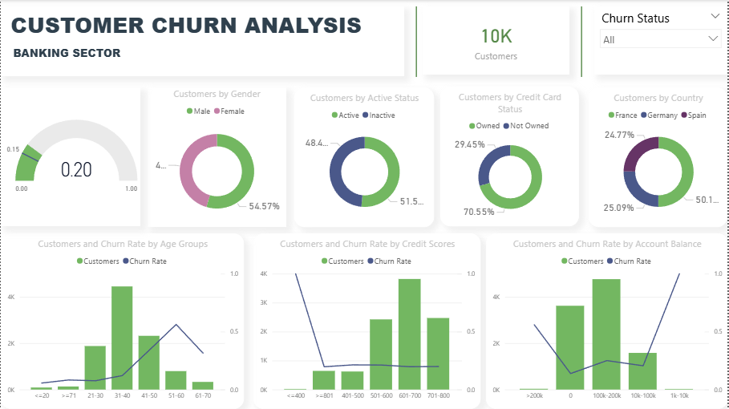

# 🏦 Banking Customer Churn Analysis | Power BI Dashboard

## 📌 Project Overview

Customer churn is one of the most important challenges faced by banks and financial institutions. Retaining existing customers is significantly more cost-effective than acquiring new ones. This project analyzes customer demographics, account characteristics, and behavioral patterns to identify factors contributing to customer churn.

Using **Power BI**, **Power Query**, **Excel**, and **DAX**, an interactive dashboard was developed to monitor churn performance and generate actionable business insights for customer retention.

---

## 🎯 Business Objective

The primary objectives of this project are:

* Analyze customer churn behavior.
* Identify high-risk customer segments.
* Measure churn performance using KPIs.
* Understand the impact of age, credit score, account balance, and customer activity on churn.
* Support data-driven retention strategies.

---

## 🛠️ Tools & Technologies

| Tool          | Purpose                               |
| ------------- | ------------------------------------- |
| Power BI      | Dashboard Development & Visualization |
| Power Query   | Data Cleaning & Transformation        |
| Excel         | Data Preparation & EDA                |
| DAX           | KPI & Measure Creation                |
| Data Modeling | Star Schema Design                    |

---

## 📂 Dataset Information

The dataset contains banking customer information including:

* Customer ID
* Credit Score
* Country
* Gender
* Age
* Tenure
* Account Balance
* Number of Products
* Credit Card Status
* Active Member Status
* Estimated Salary
* Churn Status

---

## 🧹 Data Cleaning & Transformation

Data preprocessing was performed using Excel and Power Query.

### Transformations Performed

✔ Converted data types

✔ Renamed columns for business readability

✔ Removed unnecessary fields

✔ Converted binary values into descriptive categories

✔ Created customer segments

✔ Built supporting dimension tables

✔ Created KPI helper fields

---

## ⚙️ Feature Engineering

### Credit Card Status

| Original Value | Converted Value |
| -------------- | --------------- |
| 1              | Owned           |
| 0              | Not Owned       |

### Active Status

| Original Value | Converted Value |
| -------------- | --------------- |
| 1              | Active          |
| 0              | Inactive        |

### Churn Status

| Original Value | Converted Value |
| -------------- | --------------- |
| 1              | Churned         |
| 0              | Not Churned     |

---

## 🏗️ Data Modeling

To improve performance and maintain proper category sorting, separate dimension tables were created for:

* Age Groups
* Credit Score Groups
* Account Balance Groups

The model follows a **Star Schema Design**, with the Customer Data table acting as the central fact table.

---

## 📐 DAX Measures

### Total Customers

```DAX
Customers =
COUNT('Customer Data'[Customer ID])
```

### Customers Lost

```DAX
Customer Lost =
CALCULATE(
    COUNT('Customer Data'[Churn Status]),
    'Customer Data'[Churn Status] = "Churned"
)
```

### Churn Rate

```DAX
Churn Rate =
DIVIDE(
    [Customer Lost],
    [Customers]
)
```

---

## 📈 Dashboard Features

### KPI Cards

* Total Customers
* Customers Lost
* Churn Rate
* Target Churn Rate

### Interactive Filters

* Churn Status
* Country
* Gender
* Active Status
* Credit Card Status

### Visualizations

#### Donut Charts

* Customers by Gender
* Customers by Country
* Customers by Active Status
* Customers by Credit Card Status

#### Combination Charts

Customer Count (Bar Chart) + Churn Rate (Line Chart)

Analysis performed for:

* Age Groups
* Credit Score Groups
* Account Balance Groups

---

## 📷 Dashboard Preview

> Replace the image below with your dashboard screenshot.

```markdown

```

---

## 🔍 Key Insights

* Customer churn varies significantly across different age groups.
* Customers with lower credit scores tend to exhibit higher churn rates.
* Inactive customers are more likely to churn than active customers.
* Account balance segments reveal varying levels of churn risk.
* Customer engagement plays a critical role in retention.

---

## 💡 Business Recommendations

* Develop targeted retention campaigns for high-risk customer segments.
* Increase engagement efforts for inactive customers.
* Monitor customers with lower credit scores more proactively.
* Design personalized offers based on customer behavior patterns.
* Continuously track churn KPIs to support strategic decision-making.

---

## 🚀 Skills Demonstrated

### Power BI

* Interactive Dashboard Development
* KPI Design
* Data Visualization
* Business Intelligence Reporting

### Power Query

* Data Cleaning
* Data Transformation
* Feature Engineering
* M Language

### DAX

* Measures
* KPI Calculations
* Business Metrics

### Data Modeling

* Star Schema
* Dimension Tables
* Relationship Management

### Business Analytics

* Customer Segmentation
* Churn Analysis
* Retention Analytics
* Insight Generation

---

## 📁 Repository Structure

```text
banking-customer-churn-analysis-powerbi/
│
├── README.md
├── Dashboard.png
├── Banking Customer Churn Analysis.pbix
└── Bank Customer Churn Analysis Data.csv
```

---

## 👨‍💻 Author

**Shubham Singh**

Aspiring Data Analyst | Power BI | SQL | Excel | Statistics | Python

If you found this project useful, feel free to connect with me on LinkedIn and explore my other analytics projects.
